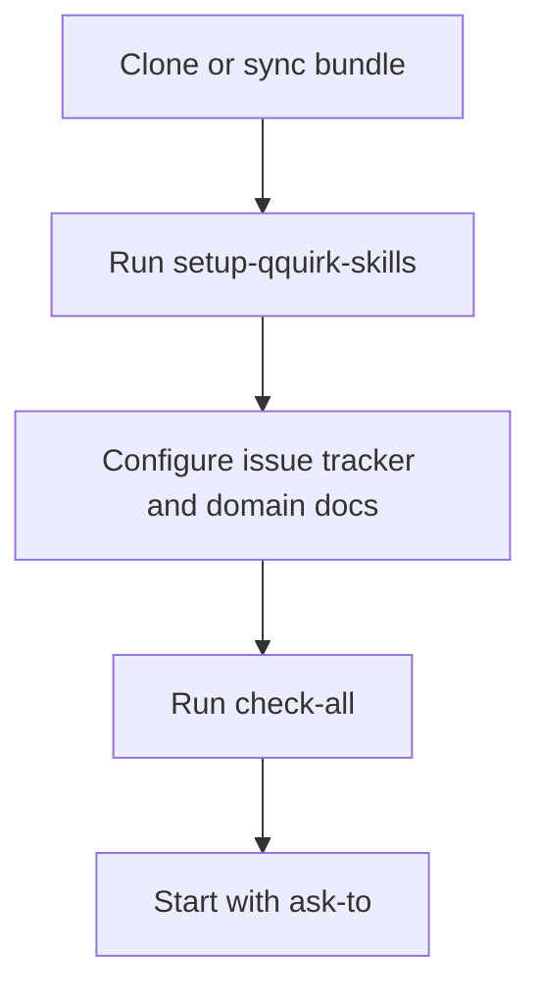
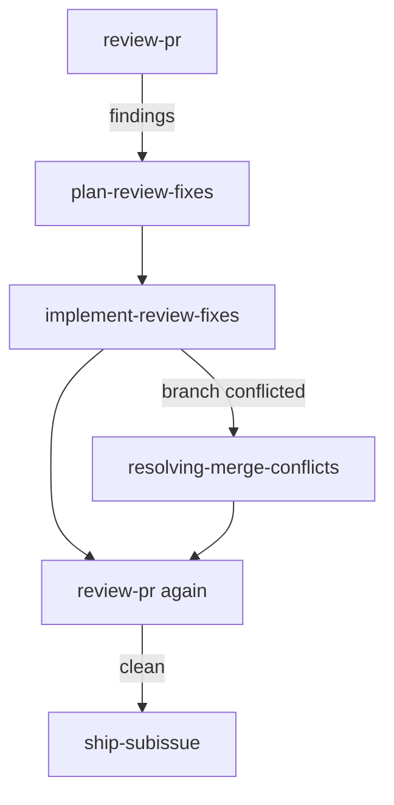
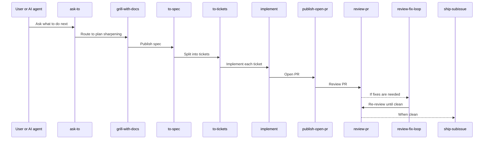

# qquirk Skills

`qquirk Skills` is a repository-local engineering workflow for taking software projects from rough intent to reviewed, validated delivery.

The bundle follows the `qquirk` method: clarify before building, preserve project context, cut work into claimable slices, review through separate Standards and Spec axes, repair through explicit plans, and ship only after evidence is clean.
When a PR branch is conflicted, the review-repair flow first routes that branch-state problem through `resolving-merge-conflicts`, then returns to `review-pr` / `review-fix-loop`, and only ships once the branch is clean and review is clean.

## What This Is

This repo is a portable skills stack for standard project development. It is meant to be copied or adapted into project repositories, then specialized through each repo's own `CONTEXT.md`, ADRs, issue tracker configuration, validation commands, and stack-specific skills.

The canonical skills live in `.agents/skills/`. `.claude/skills/` is a compatibility view made of symlinks.

## Core Flow

```text
setup-qquirk-skills
-> ask-to
-> grill-with-docs
-> to-spec
-> to-tickets
-> implement
-> publish-open-pr
-> review-pr
-> review-fix-loop when needed
-> ship-subissue after a clean review
```

## Method

The method is documented in:

- [AUTHORSHIP.md](AUTHORSHIP.md)
- [qquirk method](docs/agents/qquirk-method.md)
- [provenance](docs/agents/provenance.md)
- [adoption guide](docs/agents/adoption-guide.md)
- [skill templates](docs/agents/skill-templates.md)
- [stack matrix](docs/agents/stack-matrix.md)
- [skill style guide](docs/agents/skill-style-guide.md)
- [release checklist](docs/agents/release-checklist.md)
- [multi-agent protocol](docs/agents/multi-agent-protocol.md)

## Official Documentation

For a portable, AI-agnostic installation and usage path, start here:

- [Adoption guide](docs/agents/adoption-guide.md)
- [Skill templates](docs/agents/skill-templates.md)
- [Skills map](docs/agents/skills-map.md)
- [AI-agnostic install and sync](docs/agents/adoption-guide.md#adoption-flow)

### Installation Flow



### Review and Shipping Flow



### Standard Feature Flow



## Validate

Run these from the repo root:

```bash
node .agents/skills/platform/check-all.mjs
```

Expected result: `status: "pass"`.

## Versioning

The current version is recorded in [VERSION](VERSION). Release changes are recorded in [CHANGELOG.md](CHANGELOG.md).

## Distribution

Dry-run sync into another repository:

```bash
node .agents/skills/platform/sync-bundle.mjs /path/to/target-repo
```

Apply sync after reviewing conflicts:

```bash
node .agents/skills/platform/sync-bundle.mjs /path/to/target-repo --write
```

## Install In Any Repo

The bundle is designed to be copied into another repository and then specialized there.

### One-line installer

```bash
curl -fsSL https://raw.githubusercontent.com/quantumquirkxyz/skills-quantumquirkxyz/main/scripts/install-qquirk-skills.sh | bash -s -- /path/to/target-repo
```

If you already have a local checkout of this bundle, use:

```bash
bash scripts/install-qquirk-skills.sh /path/to/target-repo
```

If you prefer to inspect first and then install from a clone:

```bash
git clone https://github.com/quantumquirkxyz/skills-quantumquirkxyz.git
cd skills-quantumquirkxyz
bash scripts/install-qquirk-skills.sh /path/to/target-repo
```

The installer copies the bundle files that matter for downstream use:

- `.agents/skills/`
- `.claude/skills/`
- `docs/agents/`
- `docs/adr/README.md`
- `CONTEXT.md`
- `skills-lock.json`

After installation:

1. Run `setup-qquirk-skills` in the target repo.
2. Follow the [adoption guide](docs/agents/adoption-guide.md) to set the issue tracker, domain docs, and validation commands.
3. Use `ask-to` or the standard flow to route work.

## Authorship

Copyright (c) 2026 Jhuomar Boskoll Quintero.

The project is MIT licensed. See [LICENSE](LICENSE).
