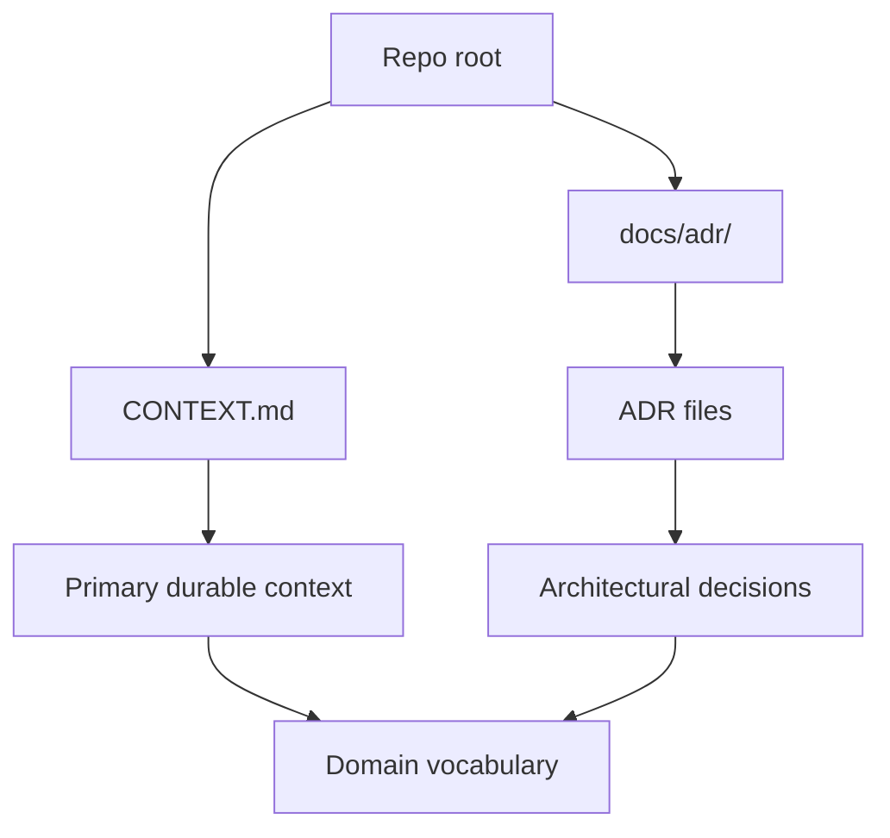

# Domain Docs

## Layout

## Consumer rules

- Keep `CONTEXT.md` at the repo root as the primary durable context file.
- Keep ADRs under `docs/adr/` when the repo adopts architectural decisions.
- Read durable docs before tactical ticket or implementation details when a skill depends on project vocabulary.

## Notes

- This repo currently uses a single repository context rather than multiple context partitions.
