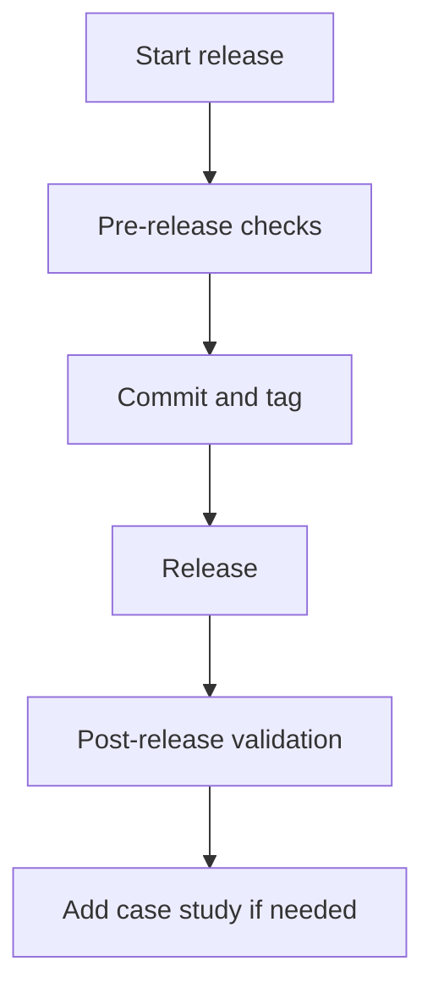

# Release Checklist

Use this checklist before publishing a new quirk Skills version.

## Pre-release

- [ ] Update `VERSION`.
- [ ] Update `CHANGELOG.md`.
- [ ] Update `docs/agents/provenance.md` for new, renamed, or retired skills.
- [ ] Update `docs/agents/skills-map.md` if routing changed.
- [ ] Add or update scenarios for workflow changes.
- [ ] Add or update behavioral fixtures for artifact-template changes.
- [ ] Run `node .agents/skills/platform/check-all.mjs`.
- [ ] Verify no project-specific vocabulary leaked into reusable docs.

## Release

- [ ] Commit only scoped release files.
- [ ] Tag as `v<version>`.
- [ ] Push branch and tag.
- [ ] Publish release notes from `CHANGELOG.md`.

## Post-release

- [ ] Sync one target repo using dry-run first.
- [ ] Run the target repo validation commands.
- [ ] Add a case study if the release exposed a method change.
