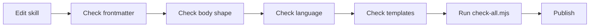

# Skill Style Guide

Use this guide when editing or adding qquirk Skills.



## Frontmatter

- `name` matches the folder name.
- `description` states what the skill does and when to use it.
- `capabilities`, `inputs`, `outputs`, `sideEffects`, `stopCondition`, and `risk` must match behavior.
- A skill that writes code, tracker state, branches, PRs, or docs is not `risk: low` unless the write is purely local and explicitly harmless.

## Body Shape

- Start with the purpose and boundary.
- Include a `Contract` section for non-trivial skills.
- Include ordered steps only when sequence matters.
- Include completion criteria that are checkable.
- Push mode-specific details into references instead of bloating `SKILL.md`.

## Language

- Use qquirk vocabulary from `CONTEXT.md` and `docs/agents/qquirk-method.md`.
- Avoid person-branded names and repository-specific examples.
- Prefer "source of truth", "scope", "validation", "owner", and "next consumer" over vague status language.

## Templates

- Follow the template owned by the skill you are editing, and keep shared artifact principles in `docs/agents/skill-templates.md`.
- Treat the skill-specific template as the source of truth for shape, and keep the repository-level index as the map, not the contract.
- Published artifacts must not contain placeholders.
- Use examples only when they are generic or clearly marked as examples.
- If a skill produces a new durable artifact shape, add a new skill-owned reference instead of teaching the whole repo a new generic template.

## Validation

After every skill edit:

```bash
node .agents/skills/platform/check-all.mjs
```
