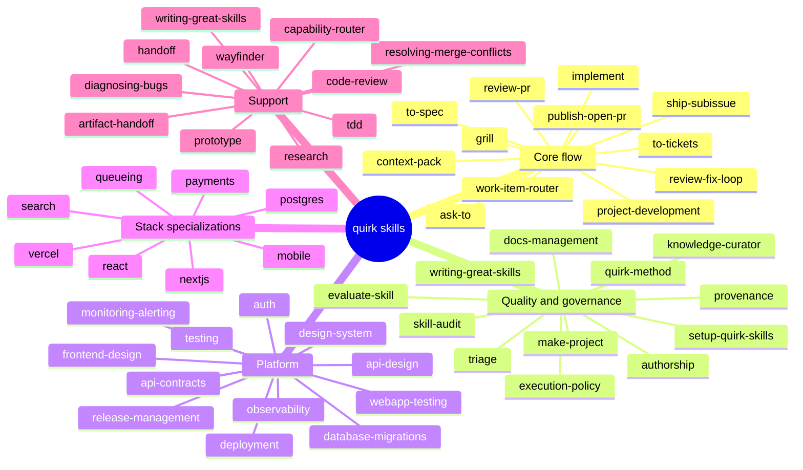

# Skills Map

## Core flow

| Skill | Purpose |
|---|---|
| `ask-to` | Route to the right next step |
| `grill` / `grilling` / `grill-me` / `grill-with-docs` | Sharpen plans through interview |
| `project-development` | Evaluate project shape and starting point |
| `context-pack` | Build a minimal fresh context pack |
| `work-item-router` | Force reading the governance index before routing |
| `domain-modeling` | Build and sharpen domain model |
| `codebase-design` | Design deep modules and seams |
| `to-spec` | Turn conversation into a published spec |
| `to-tickets` | Break plan into tracer-bullet tickets |
| `implement` | Implement work from spec or tickets |
| `publish-open-pr` | Open a PR from an issue branch |
| `review-pr` | Review PR against Standards and Spec axes |
| `review-fix-loop` | Orchestrate review-repair loop |
| `plan-review-fixes` | Convert review findings into a remediation plan |
| `implement-review-fixes` | Apply the planned review fixes |
| `ship-subissue` | Merge clean PR and close linked issue |

Canonical route: `setup-quirk-skills` once per repo, then `ask-to` when routing is unclear. For standard feature work, use `grill-with-docs` -> `to-spec` -> `to-tickets` -> `implement` -> `publish-open-pr` -> `review-pr`. If the review is dirty, `review-fix-loop` coordinates `plan-review-fixes` and `implement-review-fixes` until the PR is clean or blocked. `ship-subissue` owns merge, issue closure, and tracker completion only after a clean review.

## Quality and governance

| Skill | Purpose |
|---|---|
| `AUTHORSHIP.md` | Authorship and integrity rules |
| `docs/agents/quirk-method.md` | Method vocabulary and quality bar |
| `docs/agents/provenance.md` | Origin and redesign status |
| `skill-audit` | Audit bundle, lockfile, symlink parity |
| `evaluate-skill` | Evaluate skill against fixed scenarios |
| `knowledge-curator` | Keep context and ADRs coherent |
| `writing-great-skills` | Vocabulary and principles for skills |
| `execution-policy` | Decide whether a skill action is allowed |
| `docs-management` | Keep docs aligned with project shape |
| `triage` | Classify issues and PRs into durable states |
| `make-project` | Create and configure GitHub Projects |
| `setup-quirk-skills` | Configure repo for quirk workflows |

## Skill Lab

- `skill-template-generator`
- `skill-testing-framework`
- `skill-dependency-graph`
- `rule-cataloger`
- `skill-diff-analyzer`
- `interactive-tutorial-builder`
- `skill-performance-metrics`
- `integration-playground`
- `contribution-workflow-optimizer`

These Skills share the `platform/skill-lab.mjs` command surface and use the
`.skill-sandbox/` directory for experiments before promotion.

## Platform

| Skill | Purpose |
|---|---|
| `frontend-design` | Production-grade frontend interfaces |
| `design-system` | Reusable UI tokens and components |
| `webapp-testing` | Test strategy for web apps |
| `api-design` | Small, durable API seam |
| `api-contracts` | Request/response contracts and versioning |
| `auth` | Authentication and authorization seam |
| `deployment` | Build, release, and rollback seam |
| `release-management` | Release train and CI handoff |
| `monitoring-alerting` | Alerts, dashboards, runtime signals |
| `observability` | Logs, metrics, traces, and alerts |
| `testing` | Test strategy and seams |
| `database-migrations` | Safe schema change sequencing |

## Stack specializations

| Skill | Surface |
|---|---|
| `nextjs` | Next.js routes, server/client seams |
| `react` | React component structure and state |
| `vercel` | Vercel deployment and runtime |
| `postgres` | PostgreSQL schema and queries |
| `search` | Search indexing and relevance |
| `queueing` | Background processing and message flow |
| `mobile` | Device constraints, offline behavior |
| `payments` | Payment flows, reconciliation, rollback |

## Support

| Skill | Purpose |
|---|---|
| `artifact-handoff` | Transfer structured artifacts between skills |
| `handoff` | Compact conversation into handoff document |
| `prototype` | Build throwaway prototype to answer design question |
| `research` | Investigate a question against primary sources |
| `tdd` | Test-driven development |
| `diagnosing-bugs` | Diagnosis loop for hard bugs |
| `resolving-merge-conflicts` | Resolve conflicted or blocked branch state |
| `capability-router` | Route work by declared capabilities |
| `code-review` | Review changes against Standards and Spec |
| `wayfinder` | Plan huge work as a map of decision tickets |
| `writing-great-skills` | Reference for writing and editing skills |
