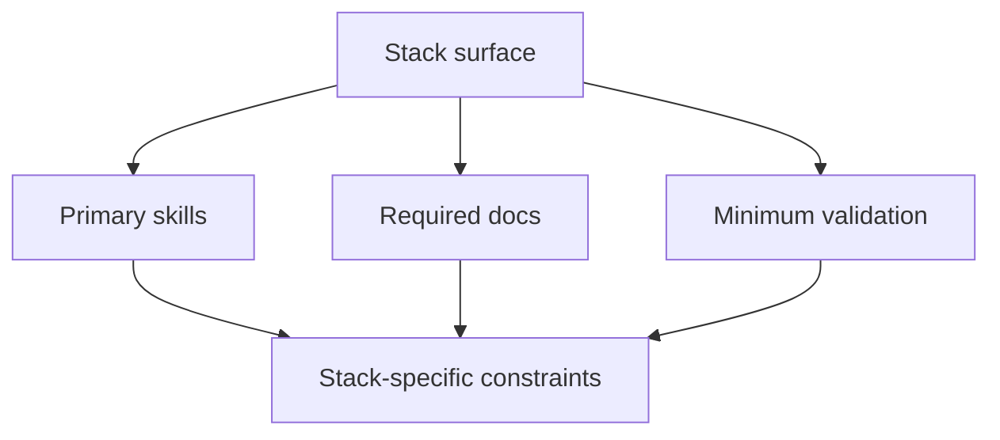

# Stack Specialization Matrix

Use this matrix when adapting qquirk Skills to a project stack.

| Stack surface | Primary skills | Required docs | Minimum validation |
|---|---|---|---|
| Next.js app | `nextjs`, `react`, `frontend-design`, `webapp-testing` | route map, rendering constraints, UI acceptance criteria | typecheck, focused component/API tests, one browser path when UI changes |
| React UI | `react`, `design-system`, `frontend-design`, `webapp-testing` | component inventory, state boundary, design tokens | component tests or Storybook checks when present, accessibility-relevant checks |
| API service | `api-design`, `api-contracts`, `auth`, `testing` | API contract, error contract, auth boundary | contract tests, integration tests, lint/typecheck |
| PostgreSQL | `database-migrations`, `postgres`, `testing` | schema decision, migration sequence, rollback notes | migration dry-run or equivalent, query tests, data integrity checks |
| Vercel | `vercel`, `deployment`, `release-management`, `monitoring-alerting` | runtime target, env vars, release gate, rollback path | build, deploy preview when available, runtime smoke check |
| Payments | `payments`, `api-design`, `database-migrations`, `observability` | reconciliation contract, failure modes, audit events | idempotency tests, reconciliation tests, webhook tests |
| Queueing | `queueing`, `observability`, `testing` | retry policy, dead-letter handling, owner | worker tests, retry tests, runbook note |
| Search | `search`, `api-design`, `observability` | index shape, freshness rules, relevance controls | indexing tests, representative query checks |
| Mobile | `mobile`, `frontend-design`, `testing` | offline behavior, device constraints, platform boundary | simulator/device path or documented manual check |

> Do not add stack-specific assumptions to core skills. Specialize through repo docs, ADRs, and stack skills.
